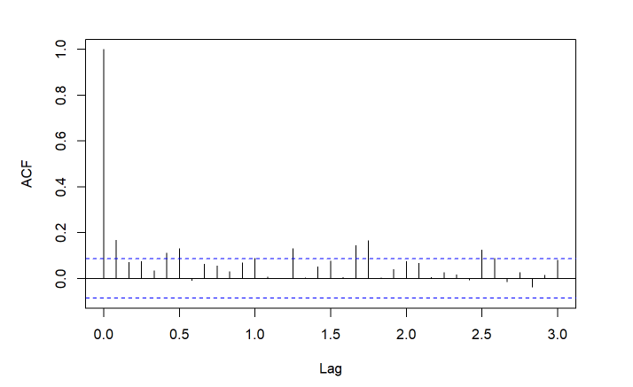

## 2.1 EGARCH模型的演变
### 2.1.1 ARCH模型
ARCH模型，又称自回归条件异方差模型(Autoregressive conditional heteroskedasticity model)。
ARCH模型出现是因为，传统计量模型假设样本方差不随时间变化，但是研究发现金融时间序列波动具有时变性，波动呈现聚集特点，因此，Engle(1982)提出ARCH模型拟合方差随时间变化的现象。

ARCH模型基本原理：随机误差项$\mu_t$在 t 时刻的条件方差与 t 时刻之前的随机误差项平方的大小有关，其基本形式如下：

均值方程：
\begin{align}
    y_t = x_t\rho+\mu_t,\mu_t \sim N(0,\delta_t^2)
\end{align}
方差方程:
\begin{align}
    \delta_t^2 = E(\mu_t^2|\mu_{t-1},\mu_{t-2},...) = \omega_0+\alpha_1\mu_{t-1}^2+...+\alpha_p\mu_{t-p}^2 = \omega_0+\sum_{i=1}^p\alpha_i\mu_{t-i}^2
\end{align}
其中，$y_t$和$x_t$分别表示自变量和因变量，$\mu_t$分别表示无序列相关的随机误差项，p代表模型的滞后阶数，回归参数$\alpha$,$\beta$要求$\alpha_i>0$，且$\alpha_1+\alpha_2+...+\alpha_p<1$。

### 2.1.2 GARCH模型
GARCH模型，又称广义ARCH模型（Generalized AutoRegressive Conditional Heteroskedasticity）。
GARCH模型出现是因为金融时间序列的条件方差存在长期自相关性，而当用ARCH(p)模型进行估计时，需要高阶滞后才能满足要求，但高阶滞后会带来大量的随机误差，给研究带来很大的不便。因此，Bollerslev(1986)年提出GARCH模型，在方差中加入条件方差$\delta^2$来解决这一问题。

GARCH模型的基本原理：以一个或多个条件方差$\delta_t^2$来代替许多随机误差项$\mu_t^2$。其基本形式如下：

均值方程：
\begin{align}
    y_t = x_t\rho+\mu_t,\mu_t \sim N(0,\delta_t^2)
\end{align}
方差方程：
\begin{align}
    \delta_t^2 = E(\mu_t^2|\mu_{t-1},\mu_{t-2},...;\delta_{t-1},\delta_{t-2}...) = \omega_0+\sum_{i=1}^p\alpha_i\mu_{t-i}^2+\sum_{j=1}^q\beta_j\delta_{t-j}^2
\end{align}
从方程中可以看出，GARCH模型与ARCH模型相比，主要不同在于多了一项，即$\delta_t^2$项，称之为GARCH项，$\mu_t^2$称为ARCH项。

### 2.1.3 EGARCH模型
EGARCH模型，又称指数GARCH模型(Exponential GARCH)。EGARCH模型出现是因为方差的确定只是考虑了$\mu$的大小，而并没有考虑符号的影响，即在使用模型时，并没有把正冲击与负冲击分开考虑。因此，尼尔森(1991)年提出EGARCH模型，可以有效克服GARCH模型在金融市场中的非对称性和杠杆效应。

EGARCH模型的基本原理，使用均值方程的随机误差项和随机误差项的绝对值与随机误差项的标准差之比来描述正负消息波动的非对称性。其基本形式如下：

均值方程：
\begin{align}
    y_t = x_t\rho+\mu_t,\mu_t \sim N(0,\delta_t^2)
\end{align}
方差方程：
\begin{align}
    In\delta_t^2 = \omega_0+\sum_{i=1}^p\alpha_i\frac{|\mu_{t-i}|}{\delta_i}+\sum_{i=1}^p\gamma_i\frac{\mu_{t-i}}{\delta_i}+\sum_{j=1}^q\beta_j In\delta_{t-j}
\end{align}
  
## 2.2 EGARCH模型的建模步骤
1.序列平稳性检验

为了避免在建模过程中出现伪回归问题，因此，首先要对序列平稳性进行检验，最常用的平稳性检验方法是ADF检验。其检验如下模型：
\begin{align}
    X_t = c_t+\beta X_{t-1}+\sum_{j=1}^{p-1}\phi_j\Delta X_{t-j}+e_t
\end{align}
原假设和备择假设为：
\begin{align}
    H_0 : \beta=0\longleftrightarrow H_1 : \beta < 0
\end{align}
检验统计量为：
\begin{align}
    ADF = \frac{\hat{\beta}}{SE(\hat{\beta)}}
\end{align}
当ADF统计量小于临界值时，拒绝原假设，认为序列是平稳的；当ADF统计量大于临界值时，不能拒绝原假设，认为序列包含单位根，是不平稳的。

2.自相关性检验

金融时间序列数据往往存在着明显的惯性与滞后性，即序列的自相关性，因此需要进行自相关性检验,并根据自相关图中自相关系数和偏自相关系数判断序列的滞后特征。其原假设和备择假设如下：
\begin{align}
H_0:序列不存在自相关性\longleftrightarrow H_1:序列存在自相关性
\end{align}
可以通过P值判断是否拒绝原假设，如果拒绝原假设则认为寻猎不存在自相关性；其次，还可以通过ACF图和PACF图判断是否存在自相关性。
```{R}

```

3.ARCH效应检验

ARCH效应检验即检验序列是否存在异方差性，只有当序列存在异方差性时，可以使用GARCH、EGARCH模型，否则不能使用该类模型。常用的检验方法有两种，一种是Ljung-Box白噪声检验，该种方法下当检验结果不显著时没有ARCH效应，检验结果显著时有ARCH效应。另一种是拉格朗日乘数检验（ARCH-LM），该方法下，原假设为不存在异方差性，因此，当LM值较大，p值较小时，拒绝原假设，说明有ARCH效应。

4.模型建立与参数估计


